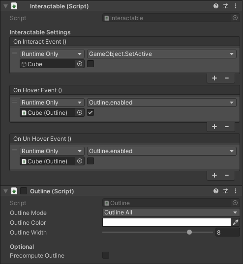
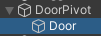
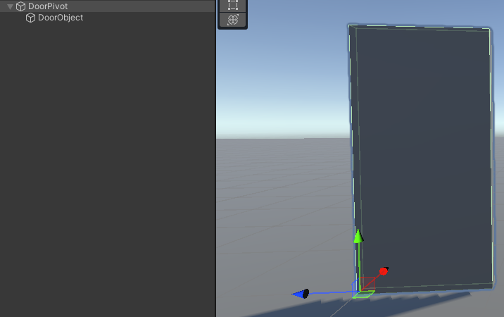
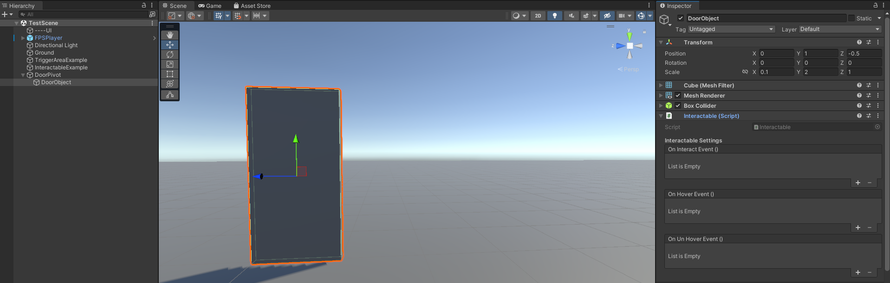
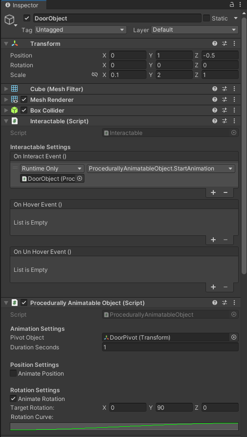

# Interaction System Help File

This file should help get you started when using the interaction system.

There are currently three scripts in this folder you can use to help make life a little easier:

1. [Interactable](#interactable)
    - [Using the Interactable script](#using-the-interactable-script)
3. [TriggerObject](#triggerobject)
    - [Using the TriggerObject script](#using-the-triggerobject-script)
5. [ProcedurallyAnimatableObject](#procedurallyanimatableobject)
    - [Using the ProcedurallyAnimatableObject script](#using-the-procedurallyanimatableobject-script)

---

## Interactable

The `Interactable` script can be attached to a game object when you want to make something happen when a player looks at it, and pressed the interact action. When you attach this script to an object as a component, it will provide you with three events:

- On Interact Event - Called when the player pressed the interact key when looking at the object.
- On Hover Event - Called when the player looks at the object.
- On UnHover Event - Called when the player looks away from the object

These events are [UnityEvents](https://docs.unity3d.com/Manual/UnityEvents.html). These events can trigger essentially anything on a Unity game object, or even call *public* methods & fields on a script attached to a game object.

---

### Using the Interactable script

Let's make a cube that disappears when you interact with it. It will also show an outline when the player looks at it.

To get started, add the `Interactable` script to any game object you want to make interactable. In this case, I have created a simple cube by right-clicking in the scene tree -> 3D object -> Cube.
Now you should see the three events mentioned earlier.

To make the object disappear when the player interacts with it, click the plus icon on the `On Interact Event`. Now, drag the cube from the scene tree into the object container that just now got created. Next, we can use the dropdown on the right to select `GameObject -> SetActive (bool)`. Underneath it there should now be a checkbox which we can use to indicate the new value. However, because we want this new value to be false, we will leave it unchecked.

For the hover/unhover outline, I have imported an asset called [Quick Outline](https://assetstore.unity.com/packages/tools/particles-effects/quick-outline-115488), and attached that to the same cube to which we added the `Interactable` script. I've also set the script to disabled so that the outline does not show by default. Now we can simply do the same thing we did for the `On Interact Event`. Click the plus. Drag the cube (or the script component) into the object container. Then select `Outline -> bool enabled` in the dropdown. For the Hover event, we will check the box to enable it. For the UnHover event, we will leave it unchecked.

If everything went correctly, it should look something like this:  

---

## TriggerObject

The `TriggerObject` can trigger events when a player walks through a certain area. When you attach this script to an object as a component, it will provide you with three events:

- On Enter Trigger - Called when an object enters the area.
- While Inside Trigger - Called ***repeatedly*** when an object is inside the area.
- On Exit Trigger - Called when an object leaves the area.

These events are also [UnityEvents](https://docs.unity3d.com/Manual/UnityEvents.html).

---

### Using the TriggerObject script

Begin by creating an empty game object by right-clicking in the scene tree, then hit `Create Empty`. Name your object accordingly, then add a collider component (any shape should work).
Place the collider in the correct spot and shape it as need be. You can check the option `Is Trigger`, but if you forget, the `TriggerObject` script will enable it for you.
Next, add the `TriggerObject` script as a component. You should now see the three events mentioned earlier.

On how to use these events, please refer to [Using the Interactable script](#using-the-interactable-script).

---

## ProcedurallyAnimatableObject

The `ProcedurallyAnimatableObject` class should help with moving and rotating objects. It gives couple of settings you can use to make objects move:

- Pivot Object - This object will be used as the pivot point. If left empty, the object the script is attached to will be used as the pivot.
- Duration Seconds - The amount of time in seconds the animation will take.
- Animate Position - If checked, the position of the object will be animated.
  - Target Position - The position that the object will move to.
  - Position Curve - The curve that the animation will follow. Can be used for smoothing the animation.
- Animate Rotation - If checked, the rotation of the object will be animated.
  - Target Rotation - The position that the object will rotate to.
  - Rotation Curve - The curve that the animation will follow. Can be used for smoothing the animation.

***NOTE:*** The pivot object is the object that will actually have its transform modified. This means that if the script is attached to ObjectA, but ObjectB is set as the pivot point, it is ObjectB that will be moved/rotated.

---

### Using the ProcedurallyAnimatableObject script

Let's make a simple door that opens when the player interacts with it. Start by adding a cube by right-clicking the scene tree, and clicking `3D Object -> Cube`. I have named mine `DoorObject`. Now, shape the cube by modifying the scale to `X: 0.1, Y: 2, Z: 1`.

Next, we will be adding the `Interactable` script as a component, as well as the `ProcedurallyAnimatableObject` script. If you don't want the player to be able to directly interact with it, but rather trigger the animation via different means (such as another script) do not add the `Interactable script`.

If you now rotate the `DoorObject` around the Y-Axis, you will see that the door rotates around the center of the object, which is not exactly how doors work! This means we will need to create a pivot point. Create a new empty object by right-clicking the scene tree, then pressing `Create Empty`. I have named mine `DoorPivot`. Next, we're going to add the `DoorObject` as a child of the `DoorPivot` by dragging the `DoorObject` onto the `DoorPivot`. It should look like this:

Select the `DoorObject`. Reset the position and rotation of the `DoorObject` back to all zeros. Then, position your `DoorObject` so that the edge lines up with the position of the `DoorPivot` like this:
 
In the screenshots you can see that the `DoorPivot` now determines the location and rotation in the world.

Next, select the `DoorObject` and find the `Pivot Object` field in the inspector. Drag the `DoorPivot` gameobject you created into this field. Now we're going to enable the `Animate Rotation` checkbox. You should now see two more fields pop up. In `Target Rotation`, we'll enter the rotation we want to rotate to ***relative to the parent of the pivot object***. In this case, we'll set the Y rotation to 90 degrees. We can also set the `Rotation Curve` to introcude a smoothing factor. If you click on the box below it, you can select a preset, or create your own curve.

Lastly, head to the `Interactable` component. Add an event to the `On Interact Event` and select the `DoorObject` as the target. On the dropdown, select `ProcedurallyAnimatableObject -> StartAnimation()`.

Now your door should rotate when the player interacts with it!

The inspector should look something like this: 

